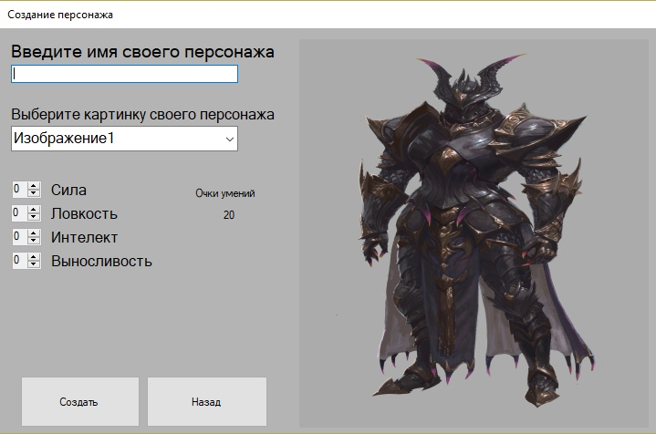
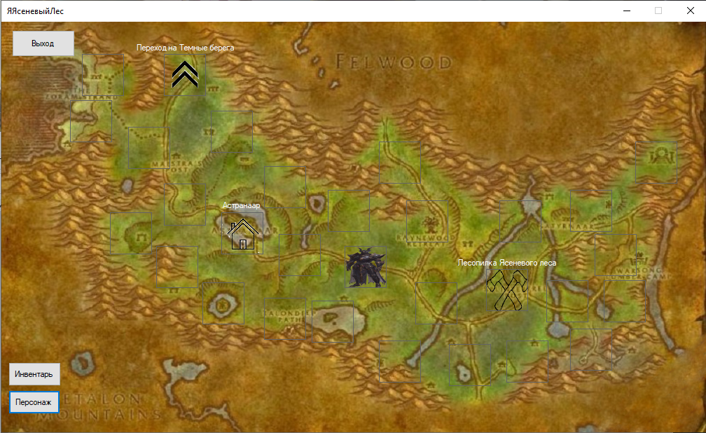
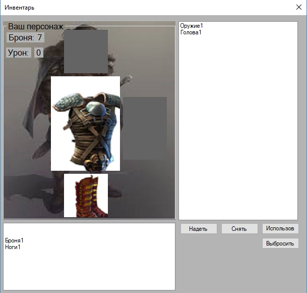
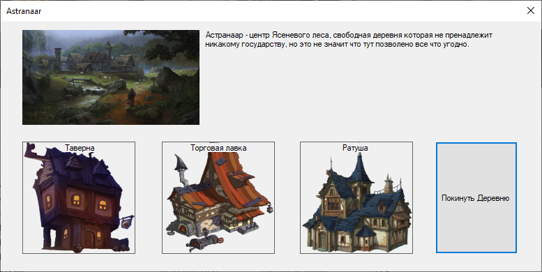
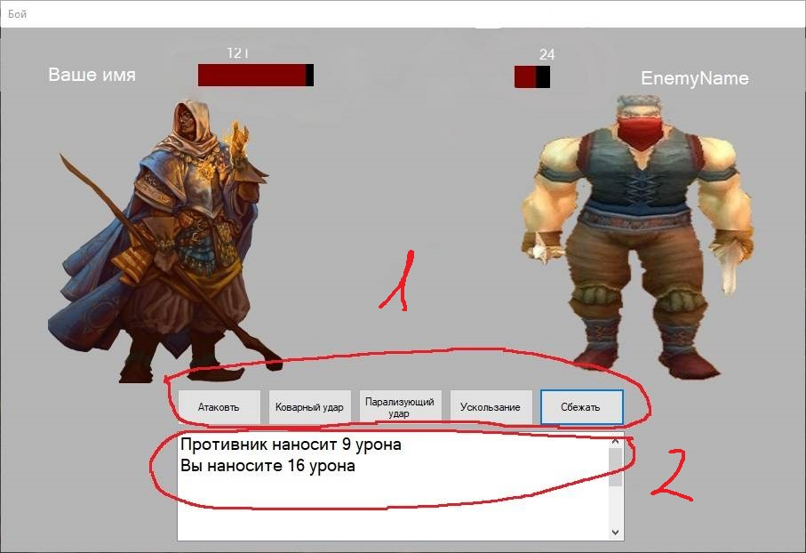
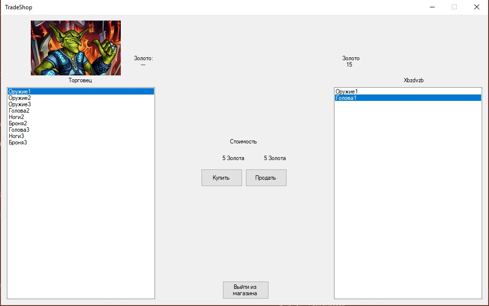
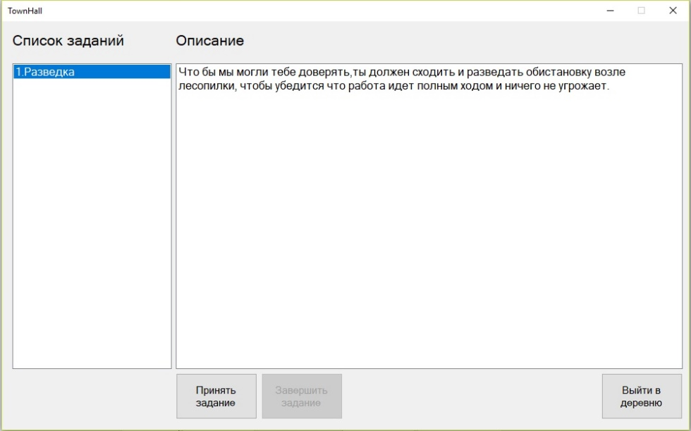

# Diplom
My first big program. 
The purpose of this application(game) defence of the diploma project. 
Evaluation this application and all diploma project: 5+.

The application is developed in C#, the code in written from Visual studio.
Foulder "Exe" contains file exe and game save, foulder "Exe+Code+Resources" contains all resources in developed and files wich code.

Aplication on interface in Russian. yes my bad:D(The habit of writing in English came with time)

<h1>Users manual.</h1>
To launch the application, use the "exe" file located in the "exe" folder.
After opens application use button new game.
For creating personage use boxs in form, thereafter use button create.

The next step is to choose do you want to take trening.
Training tell you main features in game.
After training or creatng of character we get in location the game world.
You can move around the location, using box shown in squares. Click left muose by square.
After which your character start move in the selected square.
The "Inventar" button opens form inventare your his personage, and the "character" button opens form upgrede of character. 

Using the inventory interface of the form, you can take off \ to put on items and use expendable items.

Interface of the form "character" will allow you to see the strength of your character, and upgrade his after lvlup.

On the map, you will find different places marked with icons, such as cities,questzone, crossing to the next location.

To enter the city, you need to click on its icon and wait for the dialog box to ask you if you want to enter. 
After entering, you will be able to visit the tavern, shop and Town Hall.

In order to buy items from the shop, you need to select an item from the shop's inventory and press the "Buy" button,
then if you have enough coins, the item will be sent to your inventory.
In order to sell, you need to select the item that is in your inventory accordingly.

In the Town Hall you can take an assignment for which you will receive an award.
To do so, you must select an assignment from the list and click on the 'Take assignment' button.

While performing the tasks, you will meet various opponents; to defeat your opponent, you will have to press special blows,
which are shown under the number 1 and under the number 2 the battle history is shown.

Good luck!
